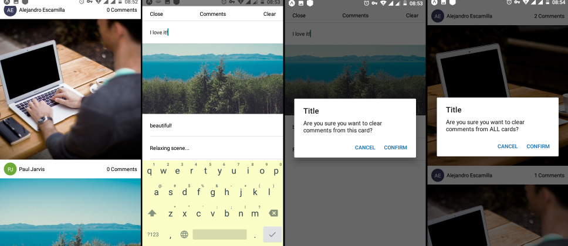

# reactive-feed
A feed of user posts, each associated with an image and a comment section.

A mobile solution based on [expo.io](https://expo.io) and [React Native](https://reactnative.dev).

A few screenshots of the Android app:

  

# Installers and source

You can find any application installers (e.g. Android apk) and source code on the [**releases** page](https://github.com/agap2-ag/reactive-feed/releases).
